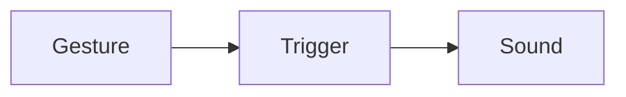
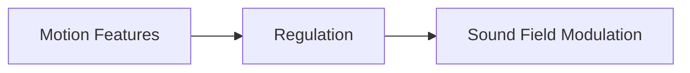
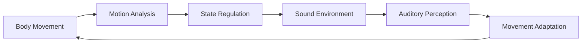

# FanRows

⚠️ The FanRows source code is currently not publicly available. This repository documents the system architecture and interaction model.

## Continuous Embodied Audio Interaction in the Browser

FanRows is an experimental system for embodied interaction with sound environments.

Instead of triggering sounds through discrete gestures, FanRows continuously regulates a layered sound environment based on body posture, motion dynamics, and stability.

The system integrates the following components:

- webcam-based pose tracking
- continuous motion feature extraction
- state-based regulation logic
- layered audio environments
- scene-based interaction spaces

Together these components form a closed feedback loop between body movement and sound space.

FanRows runs entirely in the browser and is designed as a research-oriented interaction framework.

---

## Project Website
Learn more at:  
**https://fanrows.com**

---

# Table of Contents

- Introduction
- Core Idea
- Interaction Model
- System Overview
- Motion Analysis
- Regulation Layer
- Audio Engine
- Scene System
- Mapping System
- Effect System
- Visual System
- Configuration System
- Studio Environment
- External Integration
- Technical Architecture
- Example Interaction Flow
- JSON Configuration Schema
- Example Session
- Future Development
- License

---

# Introduction

## What FanRows Is

FanRows is a browser-based system for continuous embodied audio interaction. Rather than treating gestures as discrete commands, FanRows interprets body motion as continuous signals that gradually reshape a sonic environment. The result is an evolving sound space that reacts to posture, movement intensity, stability, and sustained spatial configurations.

FanRows combines:

- pose tracking
- motion feature extraction
- state-based interaction logic
- a layered audio engine

---

# Core Idea

Most interactive music systems follow an event-based model:


FanRows instead uses continuous regulation:


Movement does not execute commands. Movement modifies the conditions of the sound environment.

---

# Interaction Feedback Loop

FanRows operates as a closed feedback loop:



The user becomes part of a dynamic system where motion and sound continuously influence each other.

---

# System Overview

FanRows consists of four main layers:

- Motion Analysis
- Regulation Layer
- Audio Engine
- Configuration System

Each layer operates continuously during interaction.

---

# Motion Analysis

FanRows uses webcam-based pose tracking.

Current implementation uses:

- MediaPipe Pose
- MediaPipe Hands (optional)

The system extracts spatial and temporal motion features such as:

- joint angles
- limb orientation
- movement velocity
- posture stability
- motion persistence

Example feature vector:

```json
{
  "velocity": 0.42,
  "acceleration": 0.18,
  "movementIntensity": 0.36,

  "stability": 0.73,
  "posturePersistence": 0.64,

  "rightArmAngle": 0.58,
  "leftArmAngle": 0.12,
  "rightElbowAngle": 0.47,
  "leftElbowAngle": 0.39,

  "shoulderWidth": 0.51,
  "bodyOrientation": 0.22,

  "handDistance": 0.34,
  "handHeight": 0.66,

  "centerX": 0.53,
  "centerY": 0.41,

  "poseConfidence": 0.92
}
```

**Motion dynamics**
| Feature				     | Meaning                              |
|--------------------|--------------------------------------|
| velocity			 	   | instantaneous body movement velocity |
| acceleration		   | change of movement velocity          |
| movementIntensity  | normalized motion energy             |

**Posture stability**
| Feature				     | Meaning                              |
|--------------------|--------------------------------------|
| stability				   | posture stability over time          |
| posturePersistence | duration a posture is maintained     |

**Joint angles**
| Feature				     | Meaning
|--------------------|--------------------------------------|
| rightArmAngle		   | normalized shoulder angle            |
| leftArmAngle		   | normalized shoulder angle            |
| rightElbowAngle	   | elbow articulation                   |
| leftElbowAngle	   | elbow articulation                   |

**Spatial features**
| Feature			       |	Meaning                             |
|--------------------|--------------------------------------|
| centerX			       | body center horizontal position      |
| centerY			       | body center vertical position        |
| handDistance       |	distance between hands              |
| handHeight	       |	vertical hand position              |

**Tracking confidence**
| Feature				     | Meaning                              |
|--------------------|--------------------------------------|
| poseConfidence     | MediaPipe tracking confidence        |


Together these features define a multidimensional motion state space used by the regulation layer.

**Regulation Layer**

The regulation layer converts motion features into stable interaction states.
Instead of reacting instantly to motion, the system evaluates:

- thresholds
- persistence over time
- spatial stability
- temporal windows

Example logic:

if pose detected for > holdTime

→ pose becomes active

This prevents unstable triggers and enables smooth interaction dynamics.

## Audio Engine

The audio engine uses a layered sound architecture. Multiple loops run simultaneously and remain synchronized.

Key characteristics:

- loops always running in sync
- gain-based activation
- BPM-synchronized playback
- continuous parameter modulation

Traditional audio engines:

- start loop
- stop loop

FanRows approach:

- loop always playing
- volume modulated

Advantages:

- seamless transitions
- no timing drift
- no playback artifacts

## Scene System

Interaction environments are structured into sessions and scenes.

Session: A session represents a complete interaction environment containing:

- scenes
- configuration parameters
- loop definitions

**Scene**

A scene defines:

- active loops
- motion mappings
- effect mappings
- visual settings

Scenes represent bounded interaction contexts.

## Scene Transitions

Scene transitions occur when sustained body states are detected.

Example:

arms crossed → switch scene

Transitions typically depend on pose persistence, stability thresholds, and temporal windows.

## Mapping System

Mappings define how motion features influence sound parameters.

| Motion Feature	 | Audio Parameter         |
|------------------|-------------------------|
|velocity	         | filter cutoff           |
|pose	             | activate loop layer     |
|stability	       | reverb size             |
|limb angle	       | pitch modulation        |

Mappings operate continuously rather than through discrete triggers.

## Effect System

FanRows supports:

- global effects
- per-layer effects
- dynamic modulation

Examples include:

- filter frequency
- reverb wet level
- chorus depth
- delay feedback

## Cue Engine

The Cue Engine introduces controlled temporal variation, such as:

- slow parameter drift
- probabilistic modulation
- evolving scene conditions

## Visual System

FanRows includes a visual feedback layer. Possible visual elements:

- skeleton visualization
- background videos
- abstract overlays

Visual feedback helps users understand the relationship between movement and sound response.

## Configuration System

All interaction environments are defined through JSON configuration files.

Configuration defines:

- sessions
- scenes
- loops
- motion mappings
- effect mappings
- visuals

This enables reproducible interaction environments.

## Studio Environment

The Studio interface provides tools to:

- configure scenes
- adjust mappings
- calibrate thresholds
- inspect pose detection

Studio functions as a development environment for interaction sessions.

## External Integration

Future versions will expose motion features to external systems.

Planned interfaces:

- OSC
- WebSocket
- MIDI

Possible integrations:

- Ableton Live
- TouchDesigner
- Unity
- Max/MSP

## Technical Architecture

FanRows is implemented entirely in the browser.

| Component        | Technology              |
|------------------|-------------------------|
| Audio            | Web Audio API / Tone.js |
| Motion Tracking  | MediaPipe               |
| Runtime          | JavaScript              |
| Configuration    | JSON                    |

Example Interaction Flow:

User raises arm
→ Pose detection extracts joint angles
→ Regulation layer detects sustained pose
→ Scene mapping activates sound layer
→ Audio engine modulates loop gain
→ Sound environment evolves

## JSON Configuration Schema

Example configuration structure for a session:

```json
{
  "stackName": "Echo Chamber",
  "stackBpm": "78",
  "globalSceneSwitchPose": {
    "pose": "armsCrossed",
    "holdTime": 1300,
    "graceMs": 250,
    "cooldownMs": 1300
  },

  "visual": {
    "imageBasePath": "/posePreviews/butoh/",
    "mode": "both",
    "background": "video",
    "backgroundSource": "/posePreviews/butoh/background-lake.mp4",
    "headless": false,

    "pointSize": 6,
    "lineWidth": 5,
    "jointColor": "rgba(75,75,120,0.7)",
    "boneColor": "rgba(75,75,120,0.5)",
    "maskColor": "rgba(200,200,200,0.7)",

    "drawTorso": false,
    "bodyFillColor": "rgba(175,75,200,0.55)",

    "drawFace": true,
    "faceStyle": "butoh",
    "faceColor": "rgba(230,230,255,0.5)",
    "drawPose": true,
    "drawHands": true
  },

  "scenes": [

    {
      "id": "birth",
      "name": "Birth from stillness",
      "poseGuide": "/posePreviews/butoh/trainer.mp4",
      "background": {
        "type": "video",
        "src": "/posePreviews/butoh/background-lake.mp4"
      },
      "visualConfig": {
        "sceneText": {
          "content": "Follow the motion of the guide\n in the small window.",
          "fadeIn": 3.0,
          "hold": 10.0,
          "fadeOut": 2.0,
          "color": "rgba(0,0,64,0.85)",
          "fontSize": 38,
          "fontFamily": "times",
          "fontWeight": "normal",
          "align": "left",
          "position": "top"
        }
      },
      "angleEffectMappings": [
        {
          "joint": "leftShoulderAngle",
          "loop": "birth_base",
          "target": "reverb.wet",
          "min": 0,
          "max": 1
        },
        {
          "joint": "rightShoulderAngle",
          "loop": "ambient-leftArmVShapeDown",
          "target": "pan.pan",
          "min": -1,
          "max": 1
        }
      ],
      "loops": {
        "birth_base": {
          "file": "/splice/Piano/BPE_120_piano_loop_walk_Cmin.ogg",
          "type": "loop",
          "autoRun": true,
          "autoMute": true,
          "fadeInTime": 1.0,
          "fadeOutTime": 10.0
        },
        "birth_rightHandAboveHead": {
          "file": "/splice/Piano/SC_IP_piano_grand_arp_ascending_Cmin.ogg",
          "pose": "rightHandAboveHead",
          "type": "oneShot"
        },
        "birth_leftHandAboveHead": {
          "file": "/splice/Piano/BPM140_Cm_Gloomy_Piano.ogg",
          "pose": "leftHandAboveHead",
          "type": "oneShot"
        },
        "birth_rightArmTShape": {
          "file": "/splice/Piano/BPE_piano_deer_Cmin.ogg",
          "pose": "rightArmTShape",
          "type": "oneShot"
        },
        "birth_leftArmTShape": {
          "file": "/splice/Piano/BPE_piano_fall_Cmin.ogg",
          "pose": "leftArmTShape",
          "type": "oneShot"
        }
      }
    },

    {
      "id": "body",
      "name": "Recognition of body and breath",
      "background": {
        "type": "video",
        "src": "/posePreviews/butoh/background-birds.mp4"
      },
      "visualConfig": {
        "sceneText": {
          "content": "Now you are on your own.",
          "fadeIn": 3.0,
          "hold": 10.0,
          "fadeOut": 2.0,
          "color": "rgba(0,0,64,0.85)",
          "fontSize": 38,
          "fontFamily": "times",
          "fontWeight": "normal",
          "align": "left",
          "position": "top"
        }
      },
      "loops": {
        "body_base": {
          "file": "/splice/Piano/SC_IP_60_piano_grand_arrangement_romantico_pt_c_Ebmaj.ogg",
          "type": "loop",
          "autoRun": true,
          "autoMute": true,
          "fadeInTime": 1.0,
          "fadeOutTime": 10.0
        },
        "body_rightHandAboveHead": {
          "file": "/splice/Cello/PJ_PPLII_Strings_one_shot_Rising_Cello_Ensemble_Chord_Dsmaj.ogg",
          "pose": "rightHandAboveHead",
          "type": "oneShot"
        },
        "body_leftHandAboveHead": {
          "file": "/splice/Strings/SLS_ES_synth_pad_string_strum_layered_long_chord_loving_you_Ebmaj7.ogg",
          "pose": "leftHandAboveHead",
          "type": "oneShot"
        },
        "body_rightArmTShape": {
          "file": "/splice/Flute/SO_AA_113_flute_love_Ebmaj.ogg",
          "pose": "rightArmTShape",
          "type": "loop",
          "fadeInTime": 1.2,
          "fadeOutTime": 10.0
        },
        "body_leftArmTShape": {
          "file": "/splice/Flute/SO_TA_102_synth_flute_cabo_Ebmaj.ogg",
          "pose": "leftArmTShape",
          "type": "loop",
          "fadeInTime": 1.2,
          "fadeOutTime": 10.0
        }
      }
    },

    {
      "id": "release",
      "name": "Release and transformation",
      "background": {
        "type": "video",
        "src": "/posePreviews/butoh/background-sun.mp4"
      },
      "loops": {
        "release_base": {
          "file": "/splice/Piano/SC_IP_120_piano_grand_arrangement_lucid_chords_two_Cmin.ogg",
          "type": "loop",
          "autoRun": true,
          "autoMute": true,
          "fadeInTime": 1.0,
          "fadeOutTime": 10.0
        },
        "release_rightHandAboveHead": {
          "file": "/splice/Vocals/SS_VMT_124_vocal_reflex_adlib_long_reverb_Cmin.ogg",
          "pose": "rightHandAboveHead",
          "type": "oneShot"
        },
        "release_leftHandAboveHead": {
          "file": "/splice/Vocals/SS_VMT_124_vocal_sacrifice_chorus_adlibs_wet_Fmin.ogg",
          "pose": "leftHandAboveHead",
          "type": "oneShot"
        },
        "release_rightArmTShape": {
          "file": "/splice/Strings/MNT_SDHJ_90_strings_violin_legato_intro_alt_wet_Cm.ogg",
          "pose": "rightArmTShape",
          "type": "oneShot"
        },
        "release_leftArmTShape": {
          "file": "/splice/Strings/MNT_TOG_80_violin_texture_intimate_tremolo_swells_wet_Cm.ogg",
          "pose": "leftArmTShape",
          "type": "oneShot"
        }
      }
    }
  ]
}
```

## Future Development

Planned directions include:

- external media system integration
- extended visual environments
- multi-user interaction
- extended motion feature extraction
- embodied interaction API
- research data analysis tools

## License

FanRows is currently released as a research prototype.
The source code is not publicly released at this stage.
This repository documents the system architecture and interaction model.
